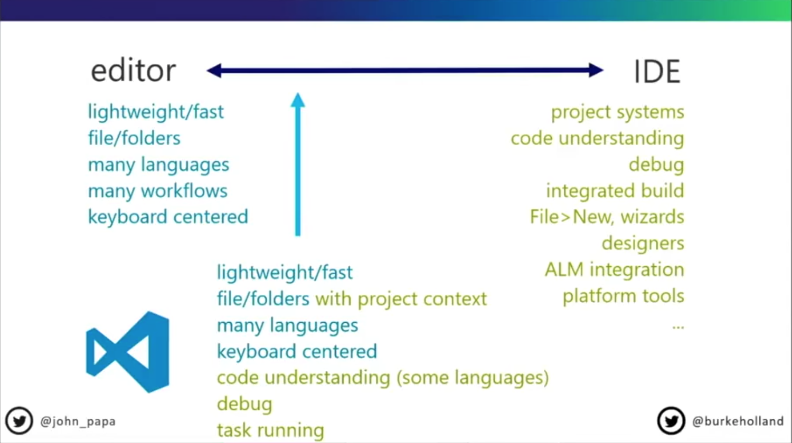

# Hello vscode

## Visual Studio Code(이하 VS Code)란 무엇인가

## 왜 VS Code 를 써야하는가

- 다양한 운영체제 지원
- 커스터마이징 기능
  - 다양한 익스텐션
- 마이크로소프트의 지원
- 다른 에디터에서 되는건 왠만하면 VS Code 에서도 다 된다
- 무료(유료도 있어? Sublime Text, Web Storm)
- https://insights.stackoverflow.com/survey/2018/

## 비슷한 포지션의 것들

- Atom
  - https://atom.io/
- Sublime Text
  - https://www.sublimetext.com/
- Brackets
  - http://brackets.io/

## 다중커서

- [Sublime Text 의 다중커서](https://www.youtube.com/watch?v=WyRlA85Fgkw)

## Emmet

- [Emmet](https://emmet.io)

## VS Code Tips and Tricks

- [VS Code Can Do That?! VS Code Tips and Tricks](https://www.youtube.com/watch?v=x5GzCohd4eo)
  - Theme
  - Material Icon Theme
  - Ligatures
  - path
  - playground
  - command + 1,2,3
  - command + w
  - command + p, p
  - hotExit
  - minimap
  - zen mode
  - command + p
    - @
    - @:
    - :
  - command + b
  - command + j
  - control + `
  - command + \ (second terminal)
  - cmatrix (fun)
  - emmet
    - image size
    - calc
  - formatOnSave
  - autoSave
