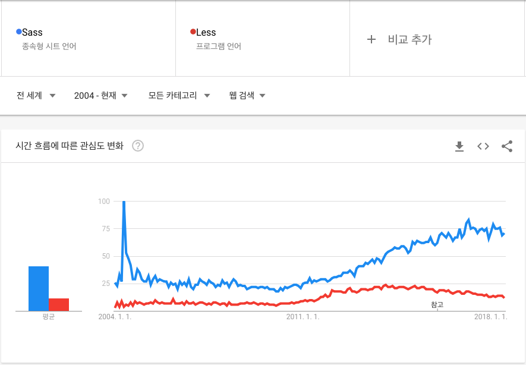

# hello Sass

## Sass 가 뭐죠?

- CSS pre-processor
  - CSS 를 확장하는 스크립팅 언어로서, 컴파일러를 통하여 브라우저에서 사용 할 수 있는 일반 CSS 문법 형태로 변환합니다
- 이점
  - 재사용할수있는 코드와 변수를 이용하여 코드를 깨끗히 작성할 수 있다
  - 스니펫(snippets)와 라이브러리들을 통한 쉬운 코드관리
  - 계산과 로직
  - 체계적이고 설정이 쉽다
- 비슷한 녀석들
  - LESS
  - Stylus
- 왜 Sass 인가?
  - 역사가 오래되었다
    - 사용자가 많다
    - 관련자료를 찾기 쉽다
  - 두가지 문법이 있다
    - 원하는 문법을 선택할 수 있다

## 샘플코드와 함께 Sass 알아보기

- hello.scss

## References

- [bootstrap/scss](https://github.com/twbs/bootstrap/tree/v4-dev/scss)
- [Sass 강좌 – 한 눈에 보기](https://velopert.com/1712)
- [CSS Preprocessors. Comparing SASS, LESS and Stylus](https://www.slideshare.net/patricka1/css-preprocessors-sass-less-and-stylus)
- [Sass vs. LESS vs. Stylus: Preprocessor Shootout](https://code.tutsplus.com/tutorials/sass-vs-less-vs-stylus-preprocessor-shootout--net-24320)
- [Less vs Sass vs Stylus](https://blog.scottlogic.com/2013/03/08/less-vs-sass-vs-stylus.html)
- [The Sass Way](http://www.thesassway.com/)
- [Sitepoint Sass Reference](https://www.sitepoint.com/sass-reference/)
- [Sitepoint Sass Articles](https://www.sitepoint.com/html-css/css/sass-css/)
